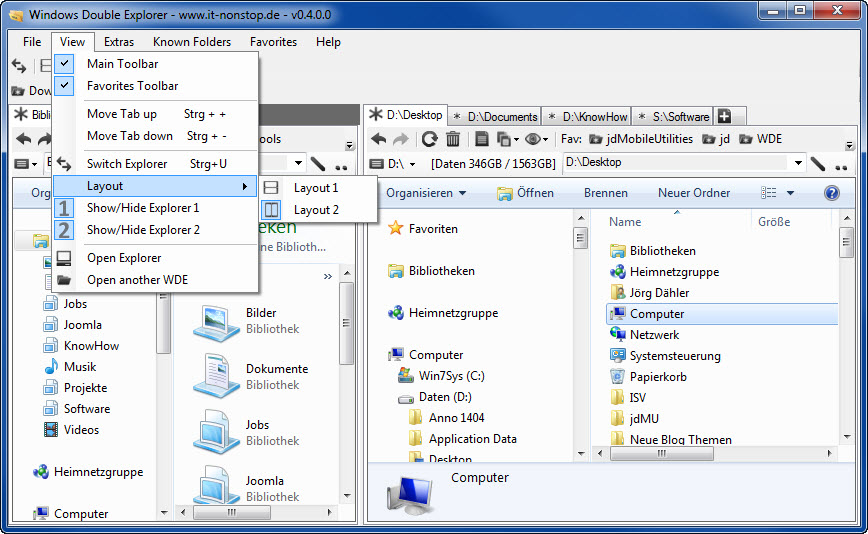

# Windows Double Explorer

Windows Double Explorer manages two or more Windows Explorer in one application.
Also you can add your favorite folders with drag and drop to the toolbar for
quick access. It's easier to manage your disc structure (a kind of Norton
Commander or Total Commander).

## History

This project is effectively a fork of the useful but now dead [Windows Double
Explorer on CodePlex](http://wde.codeplex.com/) (last updated in May 2010).
That project was licensed with GPL 2.0, so I have converted from SVN to Git and
retained the GPL 2.0 licence.
